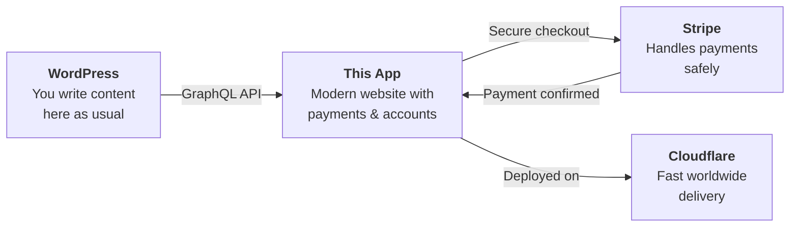
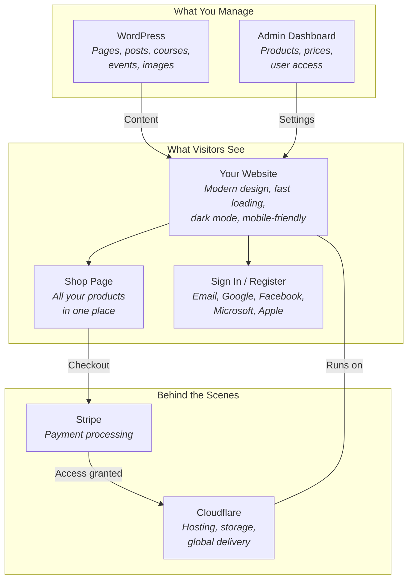
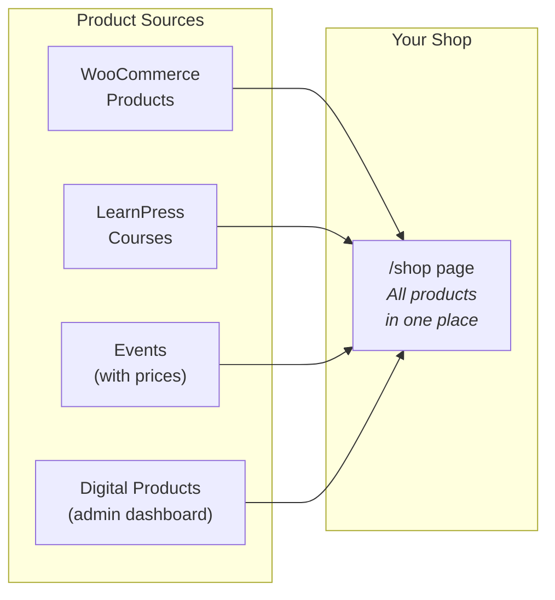
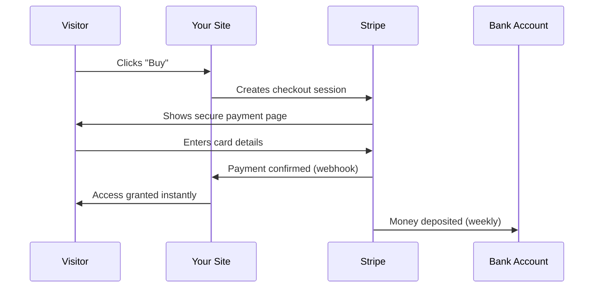
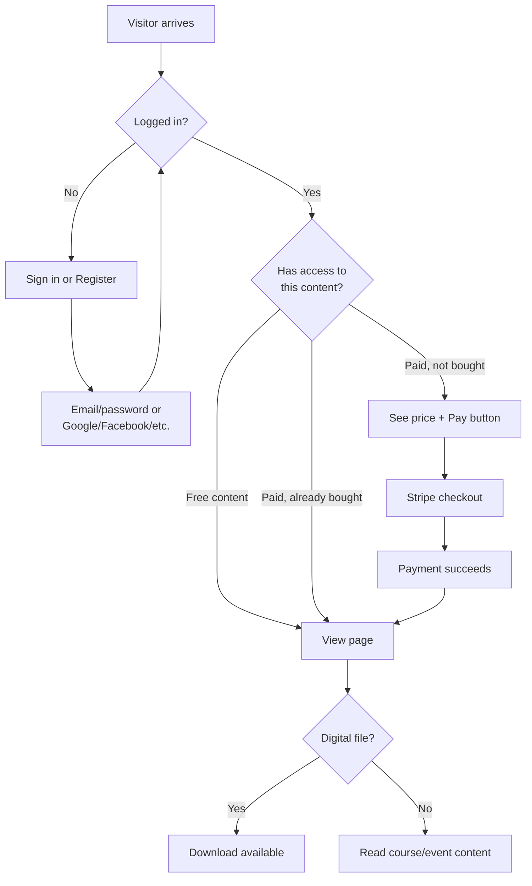
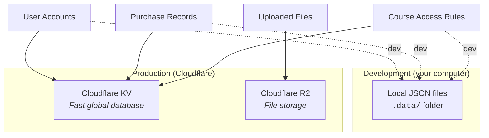
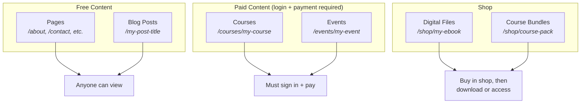
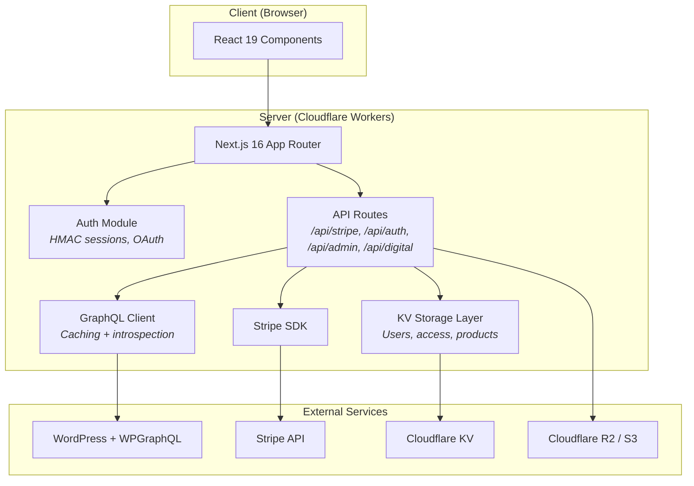

# Headless WordPress Course & Shop Platform

Turn your WordPress website into a modern online store with courses, events, digital downloads, and secure payments — without changing how you write content.

## What Is This?

If you have a WordPress website (or are thinking about setting one up), this project gives you a powerful online storefront that sits in front of your WordPress site. You keep writing pages, blog posts, and uploading images in WordPress exactly as you do today. This app takes that content and presents it on a fast, modern website with features WordPress doesn't have on its own:

- **Sell online courses** — Protect lessons behind a paywall. Visitors must sign in and pay before they can read the content.
- **Sell event access** — Charge for webinars, workshops, or in-person events.
- **Sell digital files** — PDFs, videos, templates, or any downloadable file. Buyers get instant access after payment.
- **Accept payments** — Payments are processed securely through [Stripe](https://stripe.com), the same payment system used by Shopify, Amazon, and thousands of online businesses.
- **User accounts** — Visitors can register, sign in, and see what they've purchased. Supports Google, Facebook, Microsoft, and Apple sign-in.
- **Admin dashboard** — A simple web page (at `/admin`) where you manage products, set prices, check that everything is working, and control who has access to what. No coding needed.
- **Dark mode** — Visitors can switch between light and dark viewing modes.

### How does it work?



1. You create pages, posts, courses, and events in WordPress.
2. This app automatically reads that content and displays it as a polished website.
3. When someone wants to buy a course or download, they click "Pay" and complete a secure Stripe checkout.
4. After payment, they automatically get access — no manual work for you.

## Is This Right For Me?

**This is a good fit if you:**

- Already have a WordPress site (or want to start one) and want to sell courses, events, or digital files
- Want a faster website than what WordPress themes typically offer
- Want to accept credit card payments without installing a dozen WordPress plugins
- Are comfortable following a step-by-step setup guide, or have someone who can help

**This might not be for you if you:**

- Just need a simple blog with no payments — regular WordPress is fine for that
- Need a physical product store with shipping — this is built for digital content and access control
- Want everything to happen inside the WordPress admin — this app has its own admin dashboard

## System Overview



## What You Need Before Starting

| What                                                                            | Why                                                                                                                                                                                      | Cost                |
| ------------------------------------------------------------------------------- | ---------------------------------------------------------------------------------------------------------------------------------------------------------------------------------------- | ------------------- |
| A **WordPress website** with the [WPGraphQL](https://www.wpgraphql.com/) plugin | WPGraphQL is a free plugin that lets this app read your WordPress content. Install it from Plugins → Add New → search "WPGraphQL".                                                       | Free                |
| A **Stripe account**                                                            | Stripe processes your payments. Create one at [stripe.com](https://stripe.com). You only pay when you make a sale (typically 1.4% + ~3 kr per transaction in Sweden, varies by country). | Free to create      |
| A **Cloudflare account** (recommended)                                          | Cloudflare runs your website on servers worldwide, making it fast for visitors anywhere. The free plan is enough to start.                                                               | Free plan available |
| **Node.js 18+** installed on your computer                                      | Needed to build and deploy the app. Download from [nodejs.org](https://nodejs.org).                                                                                                      | Free                |

### Optional extras

| What                                                                              | What it adds                                                                                                                    |
| --------------------------------------------------------------------------------- | ------------------------------------------------------------------------------------------------------------------------------- |
| [LearnPress](https://wordpress.org/plugins/learnpress/) plugin                    | Course management in WordPress — lessons, quizzes, curricula. Without it, you manage courses in the admin dashboard instead.    |
| An event plugin (e.g., The Events Calendar)                                       | Event pages with dates and locations. Without it, you can still create events as regular WordPress pages.                       |
| [WPGraphQL Content Blocks](https://github.com/wpengine/wp-graphql-content-blocks) | Makes your WordPress pages look pixel-perfect instead of basic HTML. Recommended if you use the WordPress block editor heavily. |
| OAuth provider credentials (Google, Facebook, etc.)                               | Lets visitors sign in with their existing accounts instead of creating a new username/password.                                 |

## Getting Started

### Step 1: Install and configure

```bash
# Download the project and install its dependencies
npm install

# Run the interactive setup wizard
npm run config
```

The setup wizard walks you through connecting to WordPress, setting up Stripe, and choosing your preferences. It creates a `.env` file with all your settings.

**If you prefer manual setup**, copy the example file and edit it:

```bash
cp .env.example .env
# Then open .env in a text editor and fill in your values
```

### Step 2: Test locally

```bash
npm run dev
```

Open `http://localhost:3000` in your browser. You should see your WordPress content displayed in the new design. Check that:

- Your pages and posts appear
- The navigation menu works
- The `/shop` page shows your products (if you've added any)

The local dev server uses [Turbopack](https://turbo.build/pack) for fast startup and instant hot-module replacement.

### Step 3: Deploy to the internet

The recommended way to put your site online is Cloudflare Workers:

```bash
npm run cf:deploy
```

See the [Cloudflare deployment guide](docs/cloudflare-workers-deploy.md) for detailed step-by-step instructions.

**Alternative:** The app also runs on Vercel, DigitalOcean, or any server that supports Node.js.

## Day-to-Day: Managing Your Store

Once deployed, you manage everything through two places:

### WordPress (content)

Write and edit your content here, just like before:

- Create pages and blog posts
- Upload images
- Manage LearnPress courses (if installed)
- Create events (if you have an event plugin)

### Admin Dashboard (shop & access)

Go to `https://your-site.com/admin/login` and sign in with your admin credentials.

For most stores, this order gives the fastest route to “ready to sell”:

1. **Welcome**: start from the control-room overview and quick cards.
2. **Health**: verify WordPress, Stripe, and storage are connected.
3. **Storage**: confirm R2/S3/WordPress upload destination and credentials.
4. **Products**: review all product sources, set prices, VAT, and visibility.
5. **Sales**: confirm payments/receipts are arriving.
6. **Support + Chat**: debug issues, scan dead links, and use AI assistance.


**Current admin sections (up to date):**

| Section       | What it does                                                                                                              |
| ------------- | ------------------------------------------------------------------------------------------------------------------------- |
| **Welcome**   | Intro story + quick navigation cards to the most-used workflows.                                                         |
| **Sales**     | Stripe charges, receipt downloads, and revenue status.                                                                   |
| **Stats**     | Traffic and performance analytics.                                                                                        |
| **Storage**   | Upload backend setup (WordPress / R2 / S3), client guidance, and object visibility.                                     |
| **Products**  | Unified product list (WooCommerce, LearnPress, events, digital), pricing, VAT, access, images/files.                   |
| **Support**   | Tickets, payment troubleshooting, and dead-link finder with internal/pseudo-external/external classification.           |
| **Chat**      | AI assistant for payments, access, docs, debug context, and operations Q&A (EN/SV/ES).                                 |
| **Health**    | Environment and integration checks.                                                                                       |
| **Style**     | Visual style reference for UI consistency.                                                                                |
| **Info**      | Build/runtime/environment diagnostics and operational metadata.                                                           |


Tip: press `Ctrl+Alt+M` to open the menu drawer anywhere in admin.

### The shop explained

Your shop (`/shop` page) can display products from several sources:



| Source                   | Where you manage it                                       | Example                                       |
| ------------------------ | --------------------------------------------------------- | --------------------------------------------- |
| **WooCommerce products** | WordPress → WooCommerce                                   | Physical or digital products from WooCommerce |
| **LearnPress courses**   | WordPress → LearnPress, plus prices in admin dashboard    | Online courses with lessons                   |
| **Events**               | WordPress → Events plugin, plus prices in admin dashboard | Paid workshops or webinars                    |
| **Digital downloads**    | Admin dashboard → Shop Products                           | PDFs, videos, templates — uploaded directly   |

You can enable or disable each source in the Products settings (visible source types). For example, if you only sell courses and digital files, turn off WooCommerce products and events.

### How payments work



1. A visitor clicks "Buy" on a product, course, or event
2. They're taken to a secure Stripe checkout page (hosted by Stripe — your site never sees their card number)
3. After payment, Stripe notifies your app automatically
4. The visitor immediately gets access to what they bought

Stripe deposits the money into your bank account on a regular schedule (typically weekly). You can see all payments, refunds, and payouts in the [Stripe Dashboard](https://dashboard.stripe.com).

### User journey



### Password reset emails

If a user forgets their password, they can click "Forgot password?" on the sign-in page. The app sends a reset link via email using [Resend](https://resend.com). You'll need a Resend API key (free tier: 100 emails/day) and a verified sender domain.

## Frequently Asked Questions

**Do I need to know how to code?**
For the initial setup, you need to be comfortable running a few commands in a terminal (or have someone help you). After that, everything is managed through WordPress and the admin dashboard — no coding.

**Will this break my existing WordPress site?**
No. This app only _reads_ from WordPress — it doesn't change your content, theme, or settings. Your WordPress site continues to work exactly as before. Visitors go to the new frontend URL instead.

**Can I use my own domain name?**
Yes. On Cloudflare, you add your domain in the dashboard and point it to your Workers project. The [deployment guide](docs/cloudflare-workers-deploy.md) explains how.

**How much does it cost to run?**

- WordPress hosting: whatever you're already paying
- Cloudflare Workers: free plan includes 100,000 requests/day — enough for most small-to-medium sites
- Stripe: no monthly fee; you pay per transaction (typically 1.4% + ~3 SEK)
- Resend (email): free up to 100 emails/day

**What currencies can I use?**
Any currency Stripe supports (150+ currencies). Set the default in your configuration; individual products can override it.

**Can multiple people be admins?**
Yes. List multiple email/password pairs separated by commas in `ADMIN_EMAILS` and `ADMIN_PASSWORDS`.

**What if Stripe is down?**
Stripe has 99.99% uptime. If it's briefly unavailable, visitors see a "try again" message. No data is lost — payments are either completed fully or not at all.

**Can I migrate away later?**
Your content stays in WordPress. User accounts and purchase records are stored in Cloudflare KV (or local files), which you can export as JSON. There's no lock-in.

## Configuration Reference

All settings are managed through environment variables. The most important ones are listed below. For the complete list with detailed explanations, see [.env.example](.env.example).

### Essential settings

| Variable                                 | What it does                                                                                                                                        |
| ---------------------------------------- | --------------------------------------------------------------------------------------------------------------------------------------------------- |
| `NEXT_PUBLIC_WORDPRESS_URL`              | Your WordPress site URL (e.g., `https://mysite.com`)                                                                                                |
| `WORDPRESS_GRAPHQL_USERNAME`             | WordPress admin username for API access                                                                                                             |
| `WORDPRESS_GRAPHQL_APPLICATION_PASSWORD` | WordPress Application Password (see [how to create one](docs/wordpress-learnpress-course-access.md#how-to-create-a-wordpress-application-password)) |
| `AUTH_SECRET`                            | A random secret for encrypting sessions. Generate with: `openssl rand -base64 32`                                                                   |
| `ADMIN_EMAILS`                           | Email addresses for admin dashboard access (comma-separated)                                                                                        |
| `ADMIN_PASSWORDS`                        | Matching passwords for each admin email (comma-separated, same order)                                                                               |
| `STRIPE_SECRET_KEY`                      | Your Stripe API key (starts with `sk_test_` or `sk_live_`)                                                                                          |
| `STRIPE_WEBHOOK_SECRET`                  | Stripe webhook signing secret (starts with `whsec_`)                                                                                                |

### Where data is stored



When deployed to Cloudflare, all app data (user accounts, purchases, access rules) is stored in Cloudflare KV — a fast, globally distributed database included in the free plan. During local development, data is stored as JSON files in the `.data/` folder.

| Variable               | Set to                     | What it controls                     |
| ---------------------- | -------------------------- | ------------------------------------ |
| `COURSE_ACCESS_STORE`  | `cloudflare`               | Where course access rules are stored |
| `USER_STORE_BACKEND`   | `cloudflare`               | Where user accounts are stored       |
| `DIGITAL_ACCESS_STORE` | `cloudflare`               | Where purchase records are stored    |
| `UPLOAD_BACKEND`       | `r2`, `s3`, or `wordpress` | Where uploaded files are stored      |

### Secrets vs. public settings

When deploying to Cloudflare Workers, there are two kinds of configuration:

- **Public settings** go in `wrangler.jsonc` under `"vars"`. These are non-sensitive values like currency codes and feature flags.
- **Secrets** (API keys, passwords, tokens) are set via the command line and never appear in any file:

```bash
npx wrangler secret put AUTH_SECRET
npx wrangler secret put STRIPE_SECRET_KEY
npx wrangler secret put STRIPE_WEBHOOK_SECRET
npx wrangler secret put ADMIN_EMAILS
npx wrangler secret put ADMIN_PASSWORDS
npx wrangler secret put RESEND_API_KEY
npx wrangler secret put RESEND_FROM_EMAIL
# ... and so on for each sensitive value
```

See the [Cloudflare deployment guide](docs/cloudflare-workers-deploy.md) for the full list of secrets to set.

## WordPress Setup

### Required plugin

| Plugin                                  | What it does                                                                                                                                   |
| --------------------------------------- | ---------------------------------------------------------------------------------------------------------------------------------------------- |
| [WPGraphQL](https://www.wpgraphql.com/) | Makes your WordPress content available to this app. **This is the only required plugin.** Install from Plugins → Add New → search "WPGraphQL". |

### Recommended plugins

All optional. The app detects them automatically — no configuration flags needed.

| Plugin                                                                                                                                 | What it adds                                                                                                                  | How to tell it's working                                                                                                    |
| -------------------------------------------------------------------------------------------------------------------------------------- | ----------------------------------------------------------------------------------------------------------------------------- | --------------------------------------------------------------------------------------------------------------------------- |
| [LearnPress](https://wordpress.org/plugins/learnpress/)                                                                                | Course management (lessons, quizzes, curriculum)                                                                              | Courses appear at `/courses`                                                                                                |
| **RAGBAZ Bridge** (included)                                                                                                       | WPGraphQL glue for LearnPress courses and events; exposes a `ragbazInfo` probe so the storefront can auto-detect capabilities | Download from Admin → Info, install via Plugins → Add New → Upload. Health check shows green for LearnPress and events. |
| [WPGraphQL Content Blocks](https://github.com/wpengine/wp-graphql-content-blocks)                                                      | Better page rendering from the block editor                                                                                   | Pages look polished instead of plain HTML. Set `NEXT_PUBLIC_WORDPRESS_EDITOR_BLOCKS=1`.                                     |
| An Event plugin                                                                                                                        | Event pages with dates/locations                                                                                              | Events appear at `/events`                                                                                                  |
| [WebP Express](https://wordpress.org/plugins/webp-express/) or [ShortPixel](https://wordpress.org/plugins/shortpixel-image-optimiser/) | Smaller, faster images                                                                                                        | Faster page loads                                                                                                           |

### How WordPress connects to the app


WPGraphQL turns your WordPress content into a structured API. The app reads this API to build your website. Your visitors go to the app's URL — they never visit WordPress directly.

## Content Types



| WordPress type     | URL pattern                | Access                    |
| ------------------ | -------------------------- | ------------------------- |
| Pages              | `/<slug>`                  | Free — anyone can view    |
| Posts              | `/<slug>`                  | Free — anyone can view    |
| LearnPress Courses | `/courses/<slug>`          | Login + payment required  |
| Events             | `/events/<slug>`           | Login + payment required  |
| Shop products      | `/shop` and `/shop/<slug>` | Buy to download or access |

## For Developers

### Tech stack

| Layer        | Technology                                               |
| ------------ | -------------------------------------------------------- |
| Frontend     | Next.js 16 (App Router), React 19, Tailwind CSS 4        |
| Bundler      | Turbopack (dev), webpack (production build)              |
| Content      | WordPress + WPGraphQL (GraphQL API)                      |
| Payments     | Stripe Checkout + Webhooks                               |
| Auth         | Custom HMAC-signed sessions (email/password + OAuth)     |
| Deployment   | Cloudflare Workers + KV (or any Node.js host)            |
| File storage | WordPress Media Library, Cloudflare R2, or S3-compatible |

### Architecture



Key design decisions:

- **Auto-detection** — LearnPress courses and Event CPTs are detected at runtime via GraphQL schema introspection. No feature flags.
- **Lazy env reads** — All `process.env` reads happen inside functions (not at module level) so Cloudflare Workers secrets properly override `.env` values at request time.
- **KV-first storage** — User data, access rules, and product entitlements use Cloudflare KV in production, with local file and in-memory fallbacks for development.
- **Unified shop** — The `/shop` page aggregates products from WooCommerce, LearnPress, Events, and digital products into a single storefront, with admin-configurable visibility per type.
- **Content fallbacks** — Catch-all routing first queries `nodeByUri` (with trailing-slash retry), then falls back to WordPress REST (pages/posts/events) and finally LearnPress `lpCourse` lookups by URI/slug to avoid 404s when WPGraphQL misses a node.
- **Source maps** — Production client bundles include source maps, served via an auth-protected `/__maps/*` proxy so stack traces are readable without exposing maps publicly.

### Project structure

```
src/
├── app/                    # Next.js routes and pages
│   ├── [...uri]/page.js    # Catch-all: renders any WordPress page/post/course/event
│   ├── __maps/             # Auth-protected source map proxy
│   ├── admin/              # Admin login and dashboard
│   ├── api/                # API routes (Stripe, auth, uploads, downloads)
│   ├── auth/               # Sign in and registration pages
│   ├── shop/               # Digital product shop
│   └── layout.js           # Root layout (header, footer, fonts, metadata)
├── components/             # React components
│   ├── admin/              # Admin dashboard UI
│   ├── blocks/             # WordPress Gutenberg block renderers
│   ├── layout/             # Header, footer, navigation, dark mode toggle
│   ├── shop/               # Shop product cards and detail views
│   └── single/             # Single post/page/course/event templates
├── lib/                    # Shared logic
│   ├── adminFetch.js       # Fetch helper with request-id tagging and duration logging
│   ├── client.js           # GraphQL client with caching and introspection
│   ├── courseAccess.js     # Course access check and granting
│   ├── digitalProducts.js  # Product catalog management
│   ├── shopProducts.js     # Unified shop item aggregation
│   ├── s3upload.js         # S3/R2 file upload client
│   ├── stripe.js           # Stripe checkout and session handling
│   └── site.js             # Site configuration (from site.json)
├── middleware.js            # Request-id tagging for admin and map routes
├── config/                 # Data files
│   └── digital-products.json  # Seed catalog (Cloudflare KV is used at runtime)
├── site.json               # Site branding, navigation, and metadata
└── theme.json              # Color palette and typography
packages/
└── ragbaz-bridge-plugin/  # WPGraphQL helper plugin (buildable .zip)
wrangler.jsonc              # Cloudflare Workers configuration
```

### Scripts

| Command              | What it does                                             |
| -------------------- | -------------------------------------------------------- |
| `npm run dev`        | Start local development server with Turbopack (fast HMR) |
| `npm run build`      | Build for production (webpack)                           |
| `npm run start`      | Run the production build locally                         |
| `npm run lint`       | Check code for errors and style issues                   |
| `npm run config`     | Interactive configuration wizard                         |
| `npm run cf:build`   | Build for Cloudflare Workers                             |
| `npm run cf:preview` | Build and preview locally with Wrangler                  |
| `npm run cf:deploy`  | Build and deploy to Cloudflare Workers                   |

### Debugging in production

Every admin and API request is tagged with a `x-request-id` header and a short-lived `reqid` cookie. The Health tab in the admin dashboard shows a live request log with status codes and durations. Combine this with `wrangler tail` to stream logs from Cloudflare Workers in real time:

```bash
npx wrangler tail
```

Production client-side source maps are served at `/__maps/*` (admin session required), so browser devtools can show original source even on minified builds.

### Detailed documentation

| Document                                                                   | Language | Contents                                            |
| -------------------------------------------------------------------------- | -------- | --------------------------------------------------- |
| [English technical reference](docs/README.en.md)                           | English  | Architecture, storage backends, GraphQL details     |
| [Svensk teknisk referens](docs/README.sv.md)                               | Svenska  | Arkitektur, lagringsbackends, GraphQL-detaljer      |
| [Performance & SEO playbook](docs/performance-and-seo.md)                  | English  | Web Vitals, bottlenecks, payload impact, SEO roadmap |
| [Cloudflare deployment](docs/cloudflare-workers-deploy.md)                 | Svenska  | Step-by-step Cloudflare Workers deployment          |
| [WordPress + LearnPress setup](docs/wordpress-learnpress-course-access.md) | English  | Plugin installation and course access configuration |

## License

Licensed under the MIT License. See [LICENSE](LICENSE).
