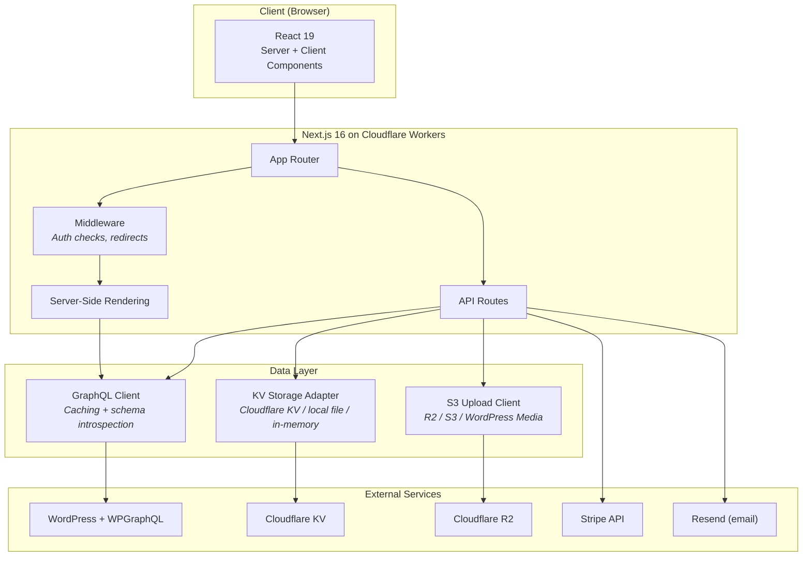
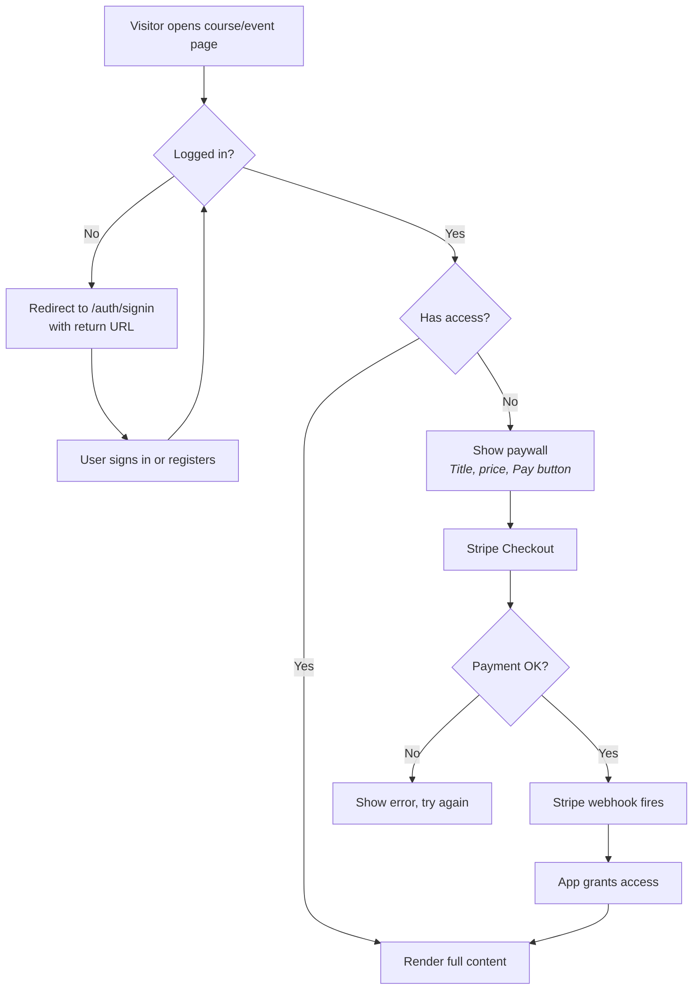
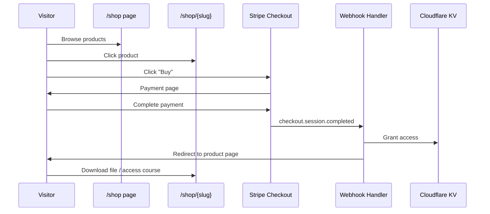
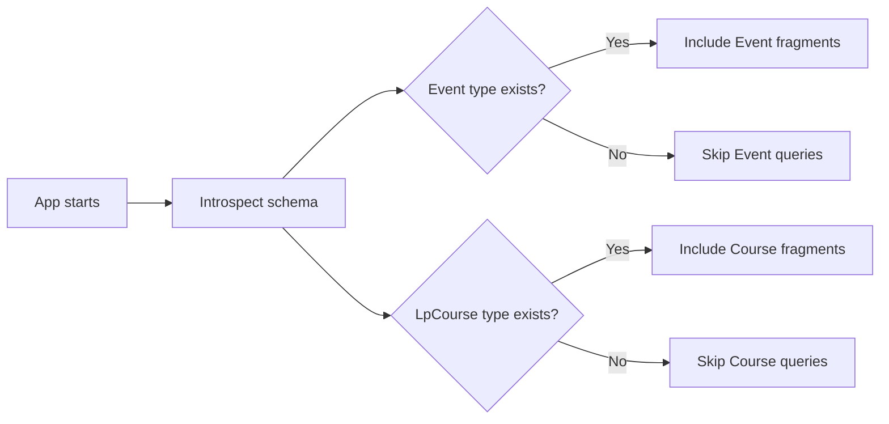
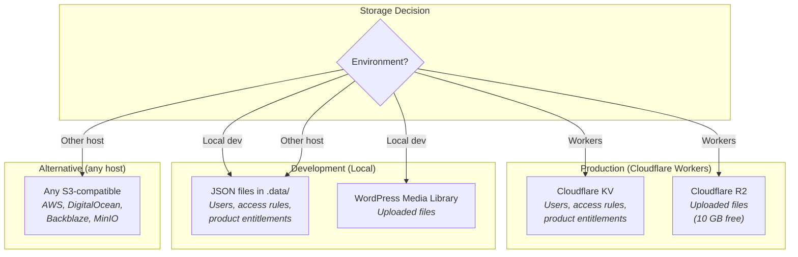
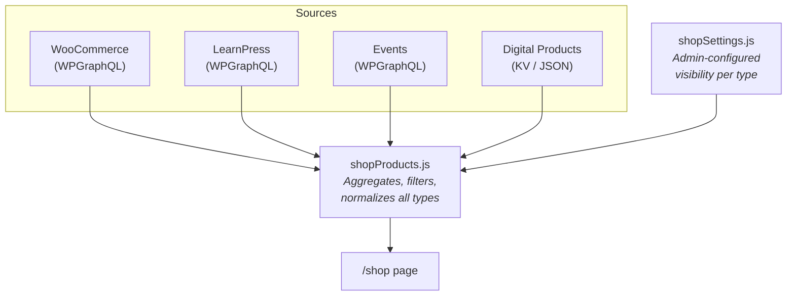
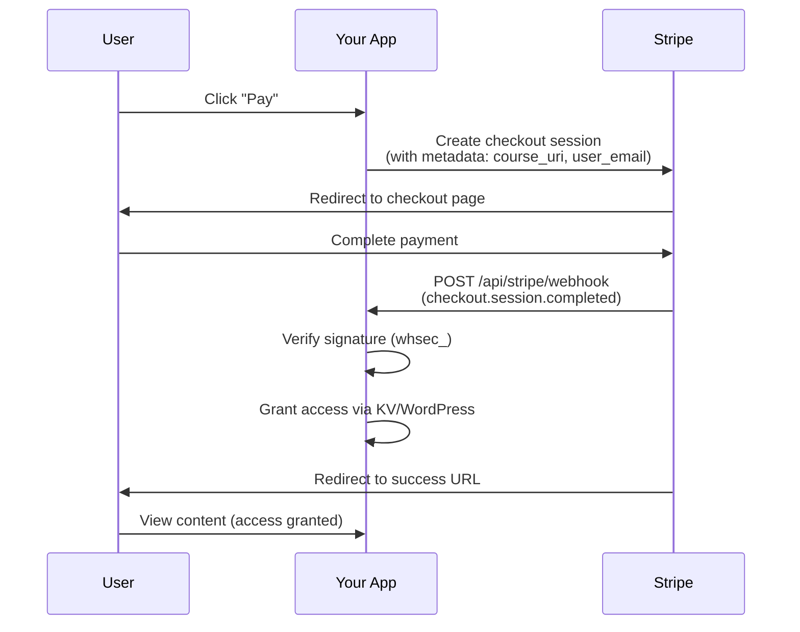
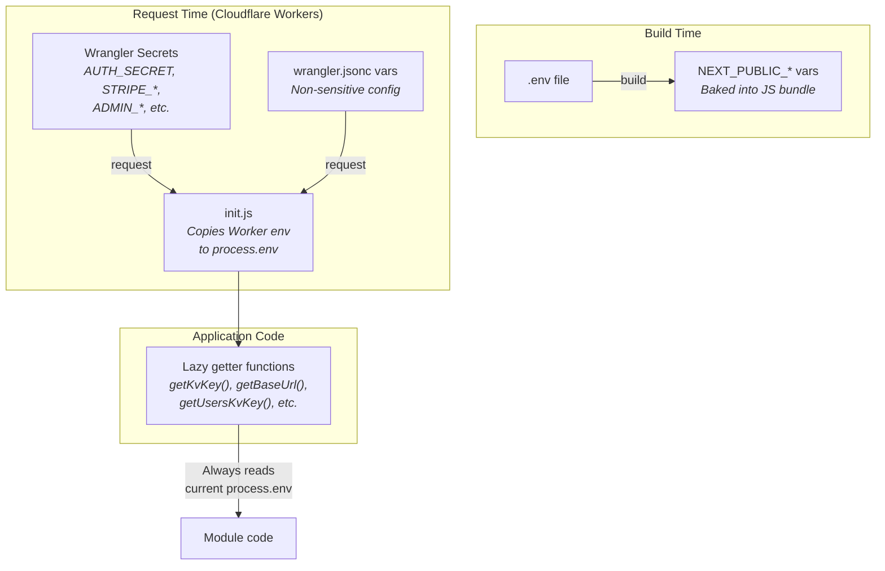

# Technical Reference (English)

This document covers the technical details of the platform. For a high-level overview and quickstart, see the [main README](../README.md).

## Focus Guides

- [Performance & SEO playbook](./performance-and-seo.md) — Web Vitals targets, roundtrip bottlenecks, payload impact, project optimizations, and roadmap tradeoffs.

## Architecture Overview



The application follows a **headless CMS** pattern:

- **WordPress** is the content management system (CMS). Authors write content there using the familiar WordPress editor. WordPress also stores images and media.
- **WPGraphQL** is a WordPress plugin that exposes all WordPress content as a GraphQL API — a structured way for other software to request exactly the data it needs.
- **This Next.js app** is the public-facing website. It fetches content from WordPress via GraphQL, renders it as HTML, handles user authentication, processes payments through Stripe, and manages access control.
- **Cloudflare Workers** (optional) runs the app at the edge — on servers close to your visitors worldwide — for fast page loads.

### Why this architecture?

WordPress is excellent for content creation but limited for custom application logic (user accounts, payment flows, access control). By separating the frontend from WordPress, you get the best of both worlds: WordPress's publishing workflow with a modern, fast, secure frontend that can do things WordPress alone cannot.

## WordPress Plugins

### Required

| Plugin                                  | Purpose                                                                                                                          |
| --------------------------------------- | -------------------------------------------------------------------------------------------------------------------------------- |
| [WPGraphQL](https://www.wpgraphql.com/) | Exposes WordPress content as a GraphQL API. The entire app depends on this. Install from Plugins → Add New → search "WPGraphQL". |

### Recommended

| Plugin                                                                                                                                 | Purpose                                                                                                                                                                                  | Detection                                                                                                                                                            |
| -------------------------------------------------------------------------------------------------------------------------------------- | ---------------------------------------------------------------------------------------------------------------------------------------------------------------------------------------- | -------------------------------------------------------------------------------------------------------------------------------------------------------------------- |
| [LearnPress](https://wordpress.org/plugins/learnpress/)                                                                                | Learning management system (LMS) — create courses with lessons, quizzes, and curricula.                                                                                                  | Auto-detected via GraphQL introspection                                                                                                                              |
| RAGBAZ-Articulate plugin                                                                                                               | GraphQL glue for LearnPress (courses/lessons + price/duration/curriculum) and generic events (Event Organiser / The Events Calendar / Events Manager) without bundling third-party code. | Auto-detected. Install from WordPress Plugins (upload ZIP from `public/downloads/ragbaz-articulate/Ragbaz-Articulate.zip`) and activate.                               |
| [WPGraphQL Content Blocks](https://github.com/wpengine/wp-graphql-content-blocks)                                                      | Provides structured Gutenberg block data instead of raw HTML, enabling pixel-perfect rendering.                                                                                          | `NEXT_PUBLIC_WORDPRESS_EDITOR_BLOCKS=1`                                                                                                                              |
| Event CPT plugin                                                                                                                       | Any plugin that registers an `Event` post type in WPGraphQL (e.g., The Events Calendar + WPGraphQL extension).                                                                           | Auto-detected via GraphQL introspection                                                                                                                              |
| [WebP Express](https://wordpress.org/plugins/webp-express/) or [ShortPixel](https://wordpress.org/plugins/shortpixel-image-optimiser/) | Converts uploaded images to modern formats (WebP/AVIF) for faster page loads.                                                                                                            | Always active once installed in WordPress                                                                                                                            |

### Cloudflare Image Optimization (Optional)

| Feature        | How to enable                                                                                     | Requirements                                                  |
| -------------- | ------------------------------------------------------------------------------------------------- | ------------------------------------------------------------- |
| Image Resizing | `CLOUDFLARE_IMAGE_RESIZING=1` — automatically resizes, compresses, and converts images on the fly | Cloudflare Pro plan + custom domain routed through Cloudflare |
| Polish         | Cloudflare Dashboard → Speed → Optimization → Polish                                              | Cloudflare Pro plan                                           |

## Core User Flows

### Course/Event access flow



### Digital product purchase flow



### Admin flow (recommended operator order)

1. **Welcome**: open the control-room cards and jump to key tasks.
2. **Health**: verify WordPress, Stripe, and storage first.
3. **Storage**: confirm upload backend and credentials.
4. **Products**: set prices/VAT/access/visibility across all sources.
5. **Sales**: verify charges and receipt availability.
6. **Support + Chat**: diagnose issues with dead-link scan + AI assistant.


## WordPress GraphQL Authentication

Two methods are supported. The app automatically selects the right one based on which environment variables are set.

| Method                   | Environment Variables                                                   | HTTP Header Sent                | When to use                                                                                                            |
| ------------------------ | ----------------------------------------------------------------------- | ------------------------------- | ---------------------------------------------------------------------------------------------------------------------- |
| **Application Password** | `WORDPRESS_GRAPHQL_USERNAME` + `WORDPRESS_GRAPHQL_APPLICATION_PASSWORD` | `Authorization: Basic <base64>` | Recommended. Works with any WordPress 5.6+ site. Generate in WordPress → Users → Your Profile → Application Passwords. |
| **Bearer token**         | `WORDPRESS_GRAPHQL_AUTH_TOKEN`                                          | `Authorization: Bearer <token>` | Use when you have a JWT auth plugin (e.g., WPGraphQL JWT Authentication).                                              |

**Priority:** If both are set, Application Password wins. The logic is in `src/lib/wordpressGraphqlAuth.js`.

**Backwards compatibility:** If `WORDPRESS_GRAPHQL_USERNAME` is set and the bearer token looks like an Application Password (contains spaces, no dots), it's automatically treated as Basic auth.

## Auto-Detection of Custom Post Types

The app queries the WordPress GraphQL schema at startup to check whether certain types exist:

```graphql
query IntrospectType($name: String!) {
  __type(name: $name) {
    name
  }
}
```

This runs for `Event` and `LpCourse`. Results are cached in memory for the lifetime of the process. If a type doesn't exist, its GraphQL fragments are omitted from queries entirely — no schema errors, no broken pages.



The introspection logic is in `src/lib/client.js` (`hasGraphQLType` function). The fragment builders are in `src/lib/fragments/`.

## LearnPress Integration

When the `LpCourse` type is detected:

- `/courses` lists all courses with price, duration, and featured image
- Individual course pages use the catch-all route (`src/app/[...uri]/page.js`) with full auth/paywall
- The RAGBAZ-Articulate plugin exposes: `price` (raw), `priceRendered` (formatted), `duration`, and `curriculum` (lesson list)
- Course access is controlled by the same `courseAccess.js` module used for all paid content

Setup: install and activate the `Ragbaz-Articulate` WordPress plugin, then verify the GraphQL fields in Admin → Health. See [detailed setup guide](wordpress-learnpress-course-access.md).

## Storage Backends



| Concern                   | Variable               | Options                 | Notes                                            |
| ------------------------- | ---------------------- | ----------------------- | ------------------------------------------------ |
| Course access rules       | `COURSE_ACCESS_STORE`  | `cloudflare`, `local`   | Who has access to which course                   |
| User data                 | `USER_STORE_BACKEND`   | `cloudflare`, `local`   | Registered user accounts                         |
| Digital product purchases | `DIGITAL_ACCESS_STORE` | `cloudflare`, `local`   | Which users bought which products                |
| File uploads              | `UPLOAD_BACKEND`       | `wordpress`, `r2`, `s3` | Where admin-uploaded images and files are stored |

**`local`** stores data as JSON files in the `.data/` directory. Good for development and single-server setups.

**`cloudflare`** stores data in Cloudflare KV, a globally distributed key-value store. Required for Cloudflare Workers deployment (Workers have no persistent filesystem).

**`wordpress`** (uploads) sends files to the WordPress Media Library via the REST API.

**`r2`** sends files to Cloudflare R2 via the S3-compatible API. Free tier: 10 GB storage, 10M reads/month.

**`s3`** sends files to any S3-compatible service (AWS S3, DigitalOcean Spaces, Backblaze B2, MinIO, Wasabi).

## Digital Products

Products are stored in `config/digital-products.json` (local dev) or Cloudflare KV (production). Each product has:

| Field         | Type                           | Description                                                                                                 |
| ------------- | ------------------------------ | ----------------------------------------------------------------------------------------------------------- |
| `name`        | string                         | Display name in the shop and Stripe checkout                                                                |
| `slug`        | string                         | URL-friendly identifier (auto-generated from name, editable)                                                |
| `type`        | `"digital_file"` or `"course"` | Determines what the buyer gets — a downloadable file or access to a course                                  |
| `description` | string                         | Shown on the product detail page                                                                            |
| `imageUrl`    | string                         | Product image URL                                                                                           |
| `priceCents`  | number                         | Price in the smallest currency unit (e.g., 4999 = 49.99 SEK). **Must be set** (can be 0 for free products). |
| `currency`    | string                         | ISO 4217 currency code, uppercase (SEK, USD, EUR, etc.)                                                     |
| `fileUrl`     | string                         | Download URL for `digital_file` products                                                                    |
| `courseUri`   | string                         | Course path (e.g., `/courses/my-course`) for `course` products                                              |
| `active`      | boolean                        | Whether the product appears in the shop                                                                     |

Products can be managed via the admin UI at `/admin` (Products tab) or by editing the JSON file directly.

## Unified Shop

The `/shop` page aggregates products from multiple sources:



Each source is fetched independently and items are only included if they have a price > 0. The admin can toggle source visibility and VAT/category behavior in the Products tab settings.

## Stripe Webhook Setup

The webhook is critical — it's how the app learns about successful payments.



1. Go to [Stripe Dashboard → Developers → Webhooks](https://dashboard.stripe.com/webhooks)
2. Click "Add endpoint"
3. URL: `https://your-domain.com/api/stripe/webhook`
4. Events to listen for: `checkout.session.completed`
5. Copy the "Signing secret" (starts with `whsec_`) and set it as `STRIPE_WEBHOOK_SECRET`

**For local development:** Use the Stripe CLI to forward webhooks:

```bash
stripe listen --forward-to localhost:3000/api/stripe/webhook
```

## Environment Variable Architecture



**Critical design choice:** All `process.env` reads happen inside functions (lazy getters), not at module level. This ensures Cloudflare Workers secrets override `.env` values at request time, because Workers inject environment variables after modules are loaded.

## Debugging

| Variable                                | What it shows                                                                                           |
| --------------------------------------- | ------------------------------------------------------------------------------------------------------- |
| `NEXT_PUBLIC_WORDPRESS_GRAPHQL_DEBUG=1` | Verbose GraphQL client logs (auth mode, endpoint URL, HTTP status, request/response payloads)         |
| `WORDPRESS_GRAPHQL_DEBUG=1`             | Server-side GraphQL debug logs where this flag is checked                                               |
| `GRAPHQL_DELAY_MS`                      | Adds artificial delay to every GraphQL request (diagnostics only; keep `0` in production)              |

**Production recommendation:** keep `NEXT_PUBLIC_WORDPRESS_GRAPHQL_DEBUG=0`, `WORDPRESS_GRAPHQL_DEBUG=0`, and `GRAPHQL_DELAY_MS=0` unless you are actively troubleshooting.

### WordPress Production Flags

In `wp-config.php` (production), keep these disabled:

```php
define('WP_DEBUG', false);
define('WP_DEBUG_LOG', false);
define('SCRIPT_DEBUG', false);
define('SAVEQUERIES', false);
define('GRAPHQL_DEBUG', false);
```

On Cloudflare Workers, use `npx wrangler tail --format pretty` to stream live production logs.

## File Structure

```
src/app/                    Next.js routes
  [...uri]/page.js          Catch-all: renders WordPress pages, posts, courses, events
  admin/                    Admin login + dashboard
  api/admin/upload/         File upload endpoint (WordPress, R2, or S3)
  api/stripe/               Stripe checkout + webhook handlers
  api/digital/              Digital product checkout + download

src/components/
  admin/AdminDashboard.js   Admin UI (products, course access, health check)
  layout/Header.js          Site header with navigation
  layout/DarkModeToggle.js  Light/dark mode switch
  layout/UserMenu.js        User icon dropdown (login/logout/admin)
  shop/                     Product listing and detail components
  single/                   Content templates (Post, Page, Course, Event)
  blocks/                   WordPress Gutenberg block renderers

src/lib/
  client.js                 GraphQL client, caching, schema introspection
  courseAccess.js            Course access check/grant logic
  shopProducts.js           Unified shop item aggregation
  shopSettings.js           Admin shop visibility settings
  s3upload.js               S3/R2 upload client
  stripe.js                 Stripe session creation and retrieval
  transformContent.js       WordPress link rewriting
  slugify.js                Shared slug/HTML utilities
  adminRoute.js             Shared admin auth guard
  wordpressGraphqlAuth.js   WordPress auth header generation
```

## Related Documentation

- [Main README](../README.md) — overview, quickstart, and full configuration guide
- [Svensk guide](README.sv.md) — this document in Swedish
- [Cloudflare deploy](cloudflare-workers-deploy.md) — step-by-step Workers deployment
- [WordPress LearnPress setup](wordpress-learnpress-course-access.md) — plugin installation guide
