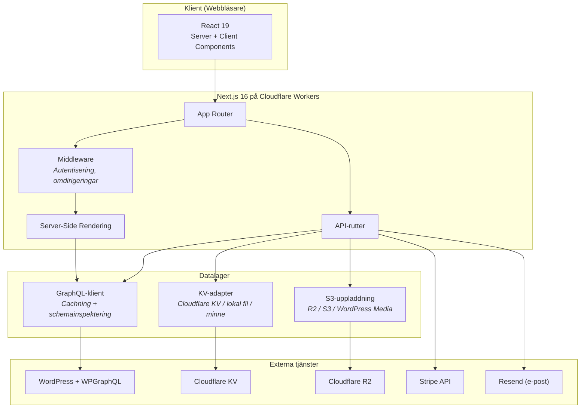
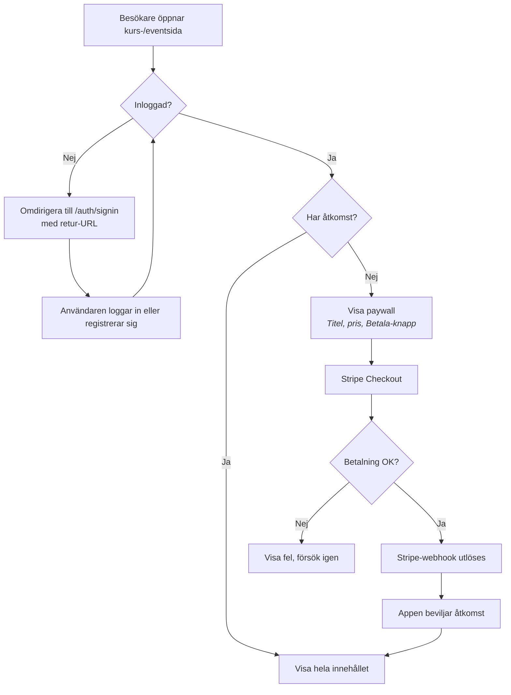
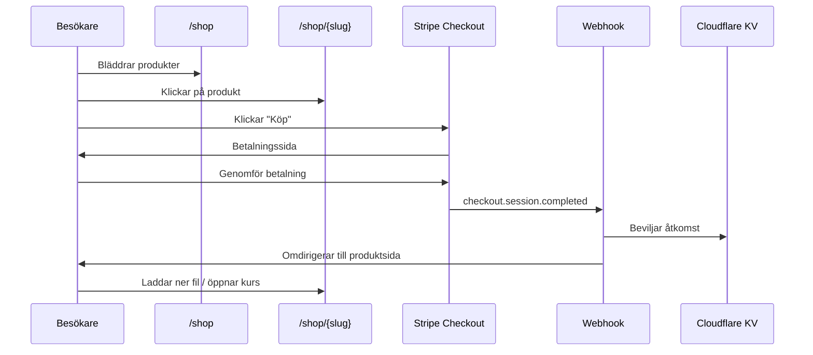
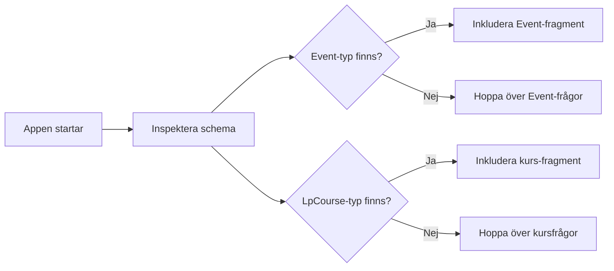
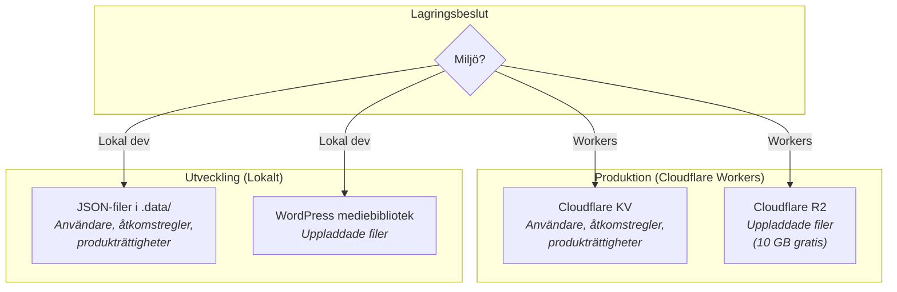
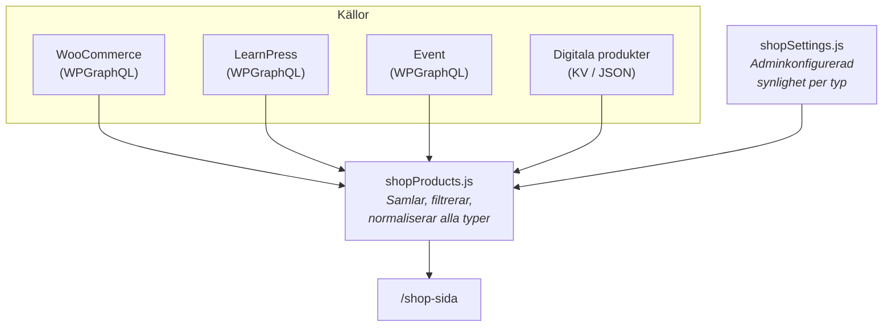
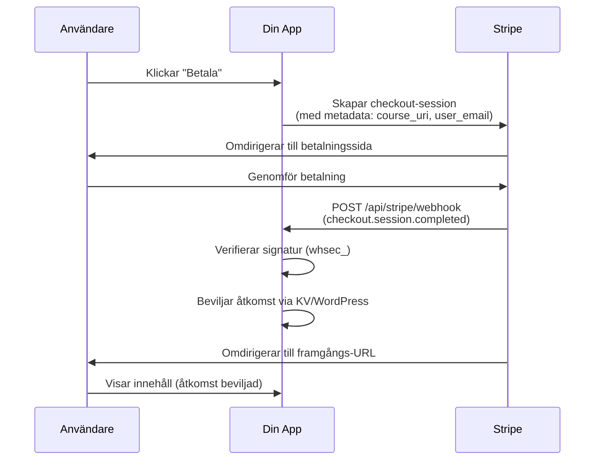
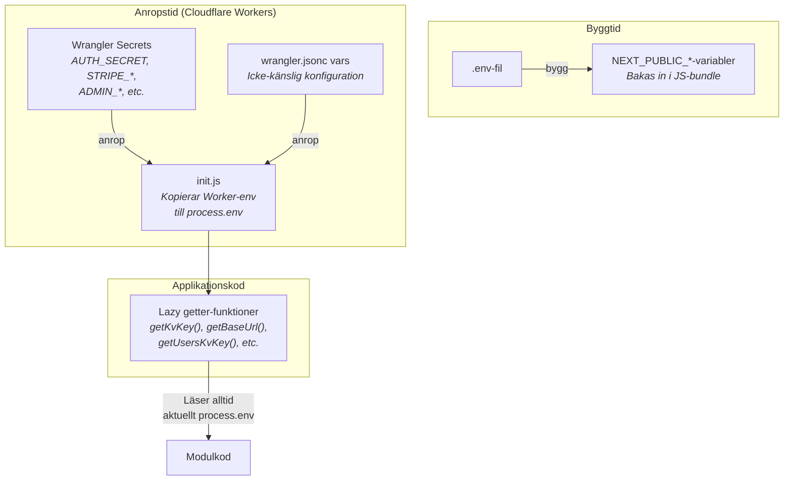

# Teknisk referens (Svenska)

Det här dokumentet beskriver den tekniska bakgrunden till plattformen. För en snabb översikt och kom-igång-guide, se [huvuddokumentationen](../README.md).

## Fokuserade guider

- [Performance & SEO playbook](./performance-and-seo.md) — Web Vitals-mål, roundtrip-flaskhalsar, payload-effekt, genomförda projektoptimeringar och roadmap-tradeoffs.

## Arkitekturöversikt



Applikationen följer ett **headless CMS**-mönster:

- **WordPress** är innehållshanteringssystemet (CMS). Här skriver du alla texter, laddar upp bilder och hanterar kurser — precis som vanligt.
- **WPGraphQL** är ett WordPress-plugin som gör allt innehåll tillgängligt via ett GraphQL-API — ett strukturerat sätt för andra program att hämta exakt den data de behöver.
- **Den här Next.js-appen** är den publika webbplatsen som besökare ser. Den hämtar innehåll från WordPress via GraphQL, hanterar inloggning, tar emot betalningar via Stripe och kontrollerar vem som har tillgång till vad.
- **Cloudflare Workers** (valfritt) kör appen på servrar nära dina besökare världen över för snabba sidladdningar.

### Varför den här arkitekturen?

WordPress är utmärkt för att skapa innehåll men begränsat när det gäller avancerad logik som användarkonton, betalningsflöden och åtkomstkontroll. Genom att separera frontend från WordPress får du det bästa av båda: WordPress välkända publiceringsverktyg kombinerat med en modern, snabb och säker webbplats som kan göra saker WordPress inte klarar på egen hand.

## WordPress-plugins

### Obligatoriska

| Plugin                                  | Syfte                                                                                                                               |
| --------------------------------------- | ----------------------------------------------------------------------------------------------------------------------------------- |
| [WPGraphQL](https://www.wpgraphql.com/) | Exponerar WordPress-innehåll som ett GraphQL-API. Hela appen bygger på detta. Installera via Plugins → Lägg till → sök "WPGraphQL". |

### Rekommenderade

| Plugin                                                                                                                                    | Syfte                                                                                                                                                                                  | Detektion                                                                                                                                                                  |
| ----------------------------------------------------------------------------------------------------------------------------------------- | -------------------------------------------------------------------------------------------------------------------------------------------------------------------------------------- | -------------------------------------------------------------------------------------------------------------------------------------------------------------------------- |
| [LearnPress](https://wordpress.org/plugins/learnpress/)                                                                                   | Kurshanteringssystem (LMS) — skapa kurser med lektioner, quiz och kursplaner.                                                                                                          | Autodetekteras via GraphQL-inspektion                                                                                                                                      |
| RAGBAZ Bridge plugin                                                                                                                  | GraphQL-lim för LearnPress (kurser/lektioner + price/duration/curriculum) och generiska event (Event Organiser / The Events Calendar / Events Manager) utan att bunta tredjepartskod. | Autodetekteras. Installera via WordPress Plugins (ladda upp ZIP från `https://ragbaz.xyz/downloads/ragbaz-bridge/ragbaz-bridge.zip`) och aktivera.                          |
| [WPGraphQL Content Blocks](https://github.com/wpengine/wp-graphql-content-blocks)                                                         | Ger strukturerad blockdata från Gutenberg istället för rå HTML, vilket möjliggör exakt rendering.                                                                                      | `NEXT_PUBLIC_WORDPRESS_EDITOR_BLOCKS=1`                                                                                                                                    |
| Event CPT-plugin                                                                                                                          | Valfritt plugin som registrerar en `Event`-posttyp i WPGraphQL (t.ex. The Events Calendar + WPGraphQL-tillägg).                                                                        | Autodetekteras via GraphQL-inspektion                                                                                                                                      |
| [WebP Express](https://wordpress.org/plugins/webp-express/) eller [ShortPixel](https://wordpress.org/plugins/shortpixel-image-optimiser/) | Konverterar bilder till moderna format (WebP/AVIF) för snabbare sidladdningar.                                                                                                         | Alltid aktiv när det är installerat                                                                                                                                        |

## Huvudflöden

### Kurs-/eventåtkomst



### Köp av digital produkt



### Adminflöde (rekommenderad ordning)

1. **Welcome**: öppna kontrollrummet och snabbkorten.
2. **Health**: verifiera WordPress, Stripe och lagring först.
3. **Storage**: kontrollera uppladdningsbackend och autentisering.
4. **Products**: sätt pris/moms/åtkomst/synlighet för alla källor.
5. **Sales**: verifiera betalningar och kvitton.
6. **Support + Chat**: felsök med dead-link-scan och AI-assistent.


## WordPress GraphQL-autentisering

Två metoder stöds. Appen väljer automatiskt rätt metod baserat på vilka miljövariabler som är satta.

| Metod                    | Miljövariabler                                                          | HTTP-header                     | När du ska använda                                                                                      |
| ------------------------ | ----------------------------------------------------------------------- | ------------------------------- | ------------------------------------------------------------------------------------------------------- |
| **Application Password** | `WORDPRESS_GRAPHQL_USERNAME` + `WORDPRESS_GRAPHQL_APPLICATION_PASSWORD` | `Authorization: Basic <base64>` | Rekommenderas. Fungerar med WordPress 5.6+. Skapa under Användare → Din profil → Application Passwords. |
| **Bearer token**         | `WORDPRESS_GRAPHQL_AUTH_TOKEN`                                          | `Authorization: Bearer <token>` | Använd med JWT-plugin (t.ex. WPGraphQL JWT Authentication).                                             |

**Prioritet:** Om båda är satta vinner Application Password. Logiken finns i `src/lib/wordpressGraphqlAuth.js`.

## Autodetektering av posttyper

Appen frågar WordPress GraphQL-schema vid uppstart för att kontrollera om vissa typer finns:

```graphql
query IntrospectType($name: String!) {
  __type(name: $name) {
    name
  }
}
```



Detta körs för `Event` och `LpCourse`. Resultat cachas i minnet. Om en typ inte finns utelämnas dess GraphQL-fragment helt — inga schemafel, inga trasiga sidor.

## LearnPress-integration

När `LpCourse`-typen detekteras:

- `/courses` listar alla kurser med pris, varaktighet och utvald bild
- Enskilda kurssidor använder catch-all-routen med full auth/paywall
- RAGBAZ Bridge-pluginet exponerar: `price` (rått), `priceRendered` (formaterat), `duration` och `curriculum`
- Kursåtkomst styrs av samma `courseAccess.js`-modul som används för allt betalt innehåll

Installation: installera och aktivera WordPress-pluginet `RAGBAZ Bridge`, och verifiera GraphQL-fälten i Admin → Health. Se [detaljerad guide](wordpress-learnpress-course-access.md).

## Lagringsbackends



| Vad                 | Miljövariabel          | Alternativ              | Förklaring                                   |
| ------------------- | ---------------------- | ----------------------- | -------------------------------------------- |
| Kursåtkomstregler   | `COURSE_ACCESS_STORE`  | `cloudflare`, `local`   | Vem som har tillgång till vilken kurs        |
| Användardata        | `USER_STORE_BACKEND`   | `cloudflare`, `local`   | Registrerade användarkonton                  |
| Digitala produktköp | `DIGITAL_ACCESS_STORE` | `cloudflare`, `local`   | Vilka användare som köpt vilka produkter     |
| Filuppladdningar    | `UPLOAD_BACKEND`       | `wordpress`, `r2`, `s3` | Var admin-uppladdade bilder och filer sparas |

**`local`** — sparar data som JSON-filer i `.data/`-katalogen. Bra för utveckling.

**`cloudflare`** — sparar data i Cloudflare KV, en globalt distribuerad nyckel-värde-databas. Krävs för Cloudflare Workers (som saknar permanent filsystem).

**`wordpress`** — skickar filer till WordPress mediebibliotek via REST API.

**`r2`** — skickar filer till Cloudflare R2 via S3-kompatibelt API. Gratisnivå: 10 GB lagring, 10M läsningar/månad, ingen kostnad för datatrafik.

**`s3`** — skickar filer till valfri S3-kompatibel tjänst (AWS S3, DigitalOcean Spaces, Backblaze B2, MinIO, Wasabi).

## Enhetlig butik

Butikssidan `/shop` samlar produkter från flera källor:



Varje källa hämtas oberoende och produkter inkluderas bara om de har pris > 0. Admin kan styra vilka källtyper som visas i Products-inställningarna.

## Digitala produkter

Produkter lagras i `config/digital-products.json` (lokal dev) eller Cloudflare KV (produktion). Varje produkt har:

| Fält          | Typ                               | Beskrivning                                                                                          |
| ------------- | --------------------------------- | ---------------------------------------------------------------------------------------------------- |
| `name`        | sträng                            | Namn i butiken och vid Stripe-betalning                                                              |
| `slug`        | sträng                            | URL-vänlig identifierare (autogenereras från namn, redigerbar)                                       |
| `type`        | `"digital_file"` eller `"course"` | Avgör vad köparen får — en nedladdningsbar fil eller åtkomst till en kurs                            |
| `description` | sträng                            | Visas på produktsidan                                                                                |
| `imageUrl`    | sträng                            | Bild-URL för produkten                                                                               |
| `priceCents`  | tal                               | Pris i minsta valutaenhet (t.ex. 4999 = 49,99 kr). **Måste anges** (kan vara 0 för gratisprodukter). |
| `currency`    | sträng                            | ISO 4217 valutakod, versaler (SEK, USD, EUR osv.)                                                    |
| `fileUrl`     | sträng                            | Nedladdnings-URL för `digital_file`-produkter                                                        |
| `courseUri`   | sträng                            | Kursens sökväg (t.ex. `/courses/min-kurs`) för `course`-produkter                                    |
| `active`      | boolean                           | Om produkten visas i butiken                                                                         |

Produkter hanteras via admin-UI:t på `/admin` (fliken Products) eller genom att redigera JSON-filen direkt.

## Stripe-webhook

Webhooken är avgörande — det är så appen får veta om lyckade betalningar.



1. Gå till [Stripe Dashboard → Developers → Webhooks](https://dashboard.stripe.com/webhooks)
2. Klicka "Add endpoint"
3. URL: `https://din-domän.se/api/stripe/webhook`
4. Events att lyssna på: `checkout.session.completed`
5. Kopiera "Signing secret" (börjar med `whsec_`) och sätt som `STRIPE_WEBHOOK_SECRET`

**Lokal utveckling:** Använd Stripe CLI:

```bash
stripe listen --forward-to localhost:3000/api/stripe/webhook
```

## Miljövariabelarkitektur



**Viktigt designval:** Alla `process.env`-läsningar sker inuti funktioner (lazy getters), inte på modulnivå. Detta säkerställer att Cloudflare Workers-hemligheter överstyr `.env`-värden vid anropstid, eftersom Workers injicerar miljövariabler efter att moduler laddats.

## Felsökning

| Variabel                                | Vad den visar                                                                                          |
| --------------------------------------- | ------------------------------------------------------------------------------------------------------ |
| `NEXT_PUBLIC_WORDPRESS_GRAPHQL_DEBUG=1` | Utförliga GraphQL-klientloggar (auth-läge, endpoint-URL, HTTP-status, request/response)             |
| `WORDPRESS_GRAPHQL_DEBUG=1`             | Server-side GraphQL-felsökningsloggar där flaggan används                                             |
| `GRAPHQL_DELAY_MS`                      | Lägger artificiell fördröjning på varje GraphQL-anrop (endast felsökning; håll `0` i produktion)     |

**Rekommendation för produktion:** håll `NEXT_PUBLIC_WORDPRESS_GRAPHQL_DEBUG=0`, `WORDPRESS_GRAPHQL_DEBUG=0` och `GRAPHQL_DELAY_MS=0` om du inte aktivt felsöker.

### WordPress-flaggor för produktion

I `wp-config.php` (produktion), håll dessa avstängda:

```php
define('WP_DEBUG', false);
define('WP_DEBUG_LOG', false);
define('SCRIPT_DEBUG', false);
define('SAVEQUERIES', false);
define('GRAPHQL_DEBUG', false);
```

På Cloudflare Workers: `npx wrangler tail --format pretty` strömmar produktionsloggar i realtid.

## Filstruktur

```
src/app/                    Next.js-rutter
  [...uri]/page.js          Catch-all: renderar WordPress-sidor, inlägg, kurser, event
  admin/                    Admin-inloggning och dashboard
  api/admin/upload/         Filuppladdning (WordPress, R2 eller S3)
  api/stripe/               Stripe checkout + webhook
  api/digital/              Köp och nedladdning av digitala produkter

src/components/
  admin/AdminDashboard.js   Admin-UI (produkter, kursåtkomst, hälsokontroll)
  layout/Header.js          Sidhuvud med navigation
  layout/DarkModeToggle.js  Ljust/mörkt läge
  layout/UserMenu.js        Användarmeny (inloggning/utloggning/admin)
  shop/                     Produktlistning och detaljvyer
  single/                   Innehållsmallar (Post, Page, Course, Event)
  blocks/                   WordPress Gutenberg-blockrenderare

src/lib/
  client.js                 GraphQL-klient med cachning och schemainspektering
  courseAccess.js            Kursåtkomstkontroll
  shopProducts.js           Enhetlig butiksaggregering
  shopSettings.js           Admin butikssynlighetsinställningar
  s3upload.js               S3/R2-uppladdningsklient
  stripe.js                 Stripe-sessioner
  transformContent.js       WordPress-länkomskrivning
  slugify.js                Delade slug/HTML-verktyg
  adminRoute.js             Delad admin-auth-guard
  wordpressGraphqlAuth.js   WordPress-autentisering
```

## Relaterad dokumentation

- [Huvuddokumentation](../README.md) — översikt, snabbstart och fullständig konfigurationsguide
- [English guide](README.en.md) — detta dokument på engelska
- [Cloudflare-deploy](cloudflare-workers-deploy.md) — steg-för-steg Workers-deployment
- [WordPress LearnPress-setup](wordpress-learnpress-course-access.md) — plugininstallation och konfiguration
