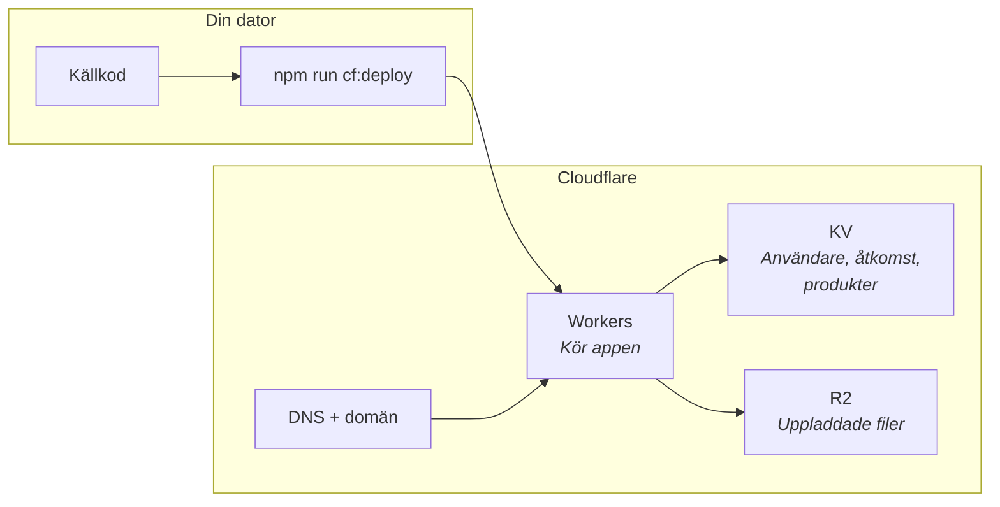
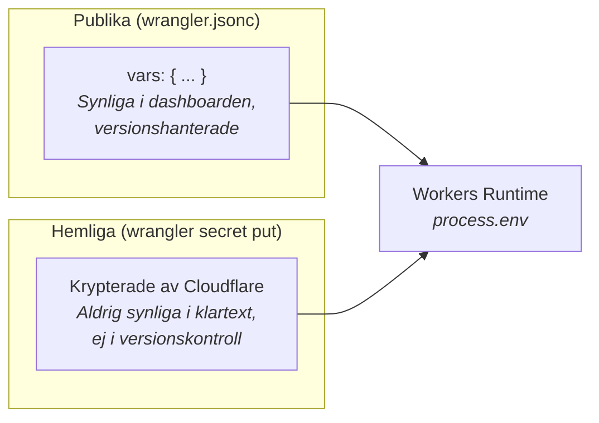
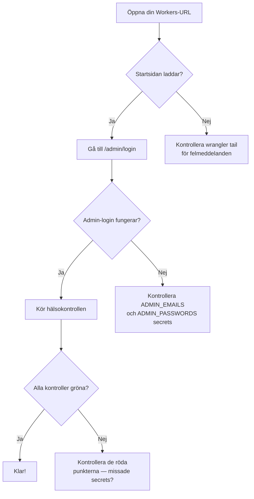
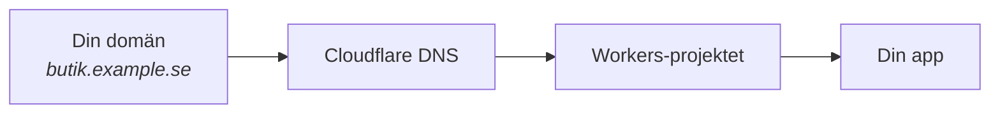

# Cloudflare Workers-deploy

Den här guiden beskriver hur du driftsätter appen på Cloudflare Workers. Workers kör din app på Cloudflares globala nätverk (över 300 datacenter) vilket ger snabba sidladdningar oavsett var besökaren befinner sig.

## Översikt



## Förkunskaper

- Ett **Cloudflare-konto** (gratis att skapa på [cloudflare.com](https://cloudflare.com))
- **Node.js 18+** installerat
- Projektet klonat och `npm install` kört

## Steg 1: Skapa KV-namespace

Cloudflare KV är en nyckel-värde-databas som lagrar kursåtkomst, användare och produktköp. Du behöver skapa ett namespace:

```bash
npx wrangler kv namespace create COURSE_ACCESS
```

Kommandot ger dig ett namespace-ID (t.ex. `0ac8a81b4e404ebbbc23172b59154191`). Uppdatera `wrangler.jsonc`:

```jsonc
"kv_namespaces": [
  {
    "binding": "COURSE_ACCESS",
    "id": "DITT-NAMESPACE-ID-HÄR",
    "remote": true
  }
]
```

## Steg 2: Konfigurera miljövariabler

### Publika variabler (icke-hemliga)

Dessa går i `wrangler.jsonc` under `vars`. De är redan förfyllda med vettigare standardvärden:

```jsonc
"vars": {
  "CLOUDFLARE_IMAGE_RESIZING": "1",
  "COURSE_ACCESS_BACKEND": "wordpress",
  "COURSE_ACCESS_STORE": "cloudflare",
  "USER_STORE_BACKEND": "cloudflare",
  "DIGITAL_ACCESS_STORE": "cloudflare",
  "PRODUCT_STORE_BACKEND": "cloudflare",
  "DEFAULT_COURSE_FEE_CURRENCY": "SEK",
  "CF_KV_KEY": "course-access",
  "CF_USERS_KV_KEY": "course-users",
  "CF_DIGITAL_ACCESS_KV_KEY": "digital-access",
  "UPLOAD_BACKEND": "r2",
  "S3_BUCKET_NAME": "ditt-bucket-namn",
  "S3_REGION": "auto",
  "S3_PUBLIC_URL": "https://pub-xxxx.r2.dev",
  "AUTH_MICROSOFT_ENTRA_ID_TENANT": "common",
  "GITHUB_REPO": "ditt-github-konto/ditt-repo",
  "GITHUB_DEPLOY_WORKFLOW": "deploy.yml"
}
```

### Hemliga variabler (API-nycklar, lösenord)



Kör dessa kommandon och klistra in värdena när du blir tillfrågad:

**Grundläggande (obligatoriska):**

```bash
# Autentisering
npx wrangler secret put AUTH_SECRET
npx wrangler secret put ADMIN_EMAILS
npx wrangler secret put ADMIN_PASSWORDS

# WordPress-anslutning
npx wrangler secret put NEXT_PUBLIC_WORDPRESS_URL
npx wrangler secret put WORDPRESS_GRAPHQL_USERNAME
npx wrangler secret put WORDPRESS_GRAPHQL_APPLICATION_PASSWORD
# ELLER: npx wrangler secret put WORDPRESS_GRAPHQL_AUTH_TOKEN

# Stripe (betalningar)
npx wrangler secret put STRIPE_SECRET_KEY
npx wrangler secret put STRIPE_WEBHOOK_SECRET

# Cloudflare KV API-åtkomst
npx wrangler secret put CLOUDFLARE_ACCOUNT_ID
npx wrangler secret put CF_API_TOKEN
npx wrangler secret put CF_KV_NAMESPACE_ID
```

**E-post (lösenordsåterställning):**

```bash
npx wrangler secret put RESEND_API_KEY
npx wrangler secret put RESEND_FROM_EMAIL
```

**Filuppladdning (R2/S3):**

```bash
npx wrangler secret put S3_ACCESS_KEY_ID
npx wrangler secret put S3_SECRET_ACCESS_KEY
```

**OAuth-leverantörer (valfritt):**

```bash
# Google
npx wrangler secret put AUTH_GOOGLE_ID
npx wrangler secret put AUTH_GOOGLE_SECRET

# Facebook
npx wrangler secret put AUTH_FACEBOOK_ID
npx wrangler secret put AUTH_FACEBOOK_SECRET

# Microsoft
npx wrangler secret put AUTH_MICROSOFT_ENTRA_ID_ID
npx wrangler secret put AUTH_MICROSOFT_ENTRA_ID_SECRET

# Apple
npx wrangler secret put AUTH_APPLE_ID
npx wrangler secret put AUTH_APPLE_SECRET
```

**GitHub-deploy (valfritt, för admin-knappen "Deploya om"):**

```bash
npx wrangler secret put GITHUB_DEPLOY_TOKEN
```

**Viktigt:** `vars` i `wrangler.jsonc` är synliga i Cloudflare-dashboarden. Använd `wrangler secret put` för allt som är känsligt.

## Steg 3: Bygg och deploya

```bash
# Bygg och deploya i ett steg
npm run cf:deploy
```

Detta kör `npx opennextjs-cloudflare build && npx wrangler deploy` under huven.

**Förhandsgranska lokalt först:**

```bash
npm run cf:preview
```

Detta bygger appen och startar en lokal Wrangler-server som simulerar Cloudflare Workers-miljön.

## Steg 4: Verifiera



Öppna URL:en som Wrangler rapporterar (t.ex. `https://ditt-projekt.ditt-konto.workers.dev`).

Kontrollera:

- Startsidan laddar och visar WordPress-innehåll
- `/admin/login` fungerar
- Kör hälsokontrollen i admin-dashboarden

## Viktiga konfigurationsdetaljer

### Kompatibilitet

`wrangler.jsonc` innehåller:

```jsonc
"compatibility_flags": ["nodejs_compat"]
```

Detta krävs för att Next.js ska fungera korrekt på Workers (ger tillgång till Node.js-API:er som `Buffer`, `crypto`, etc.).

### Lagring

På Cloudflare Workers finns inget permanent filsystem. Därför måste du använda:

- `COURSE_ACCESS_STORE=cloudflare` — kursåtkomst i KV
- `USER_STORE_BACKEND=cloudflare` — användare i KV
- `DIGITAL_ACCESS_STORE=cloudflare` — produktköp i KV

### Bilder

`next/image` fungerar som vanligt. När `CLOUDFLARE_IMAGE_RESIZING=1` är satt använder appen Cloudflares bildoptimering via `/cdn-cgi/image/`.

**OBS:** Bildoptimering kräver en Cloudflare Pro-plan med en egen domän. På `workers.dev`-subdomäner fungerar det inte. Sätt `CLOUDFLARE_IMAGE_RESIZING_DOMAIN` till din domän om du kör på workers.dev men har en domän med bildoptimering aktiverad.

### Typsnitt

Google Fonts via `next/font/google` fungerar utan extra konfiguration.

### Statiskt vs dynamiskt

Rena innehållssidor (blogginlägg, vanliga sidor) kan cachas. Följande kräver serverlogik (Workers runtime):

- Inloggning och registrering
- Admin-UI och API-rutter
- Kursåtkomstkontroll
- Stripe checkout och webhook
- Filnedladdningar

## Felsökning

### Se produktionsloggar i realtid

```bash
npx wrangler tail --format pretty
```

### Vanliga problem

| Symptom                                 | Orsak                                                       | Lösning                                                                                             |
| --------------------------------------- | ----------------------------------------------------------- | --------------------------------------------------------------------------------------------------- |
| 500 Internal Server Error på alla sidor | Hemligheter saknas eller Next.js dynamisk rendering-problem | Kör `npx wrangler tail` för att se felet. Kontrollera att alla obligatoriska secrets är satta.      |
| Bilder laddas inte                      | Bildoptimering aktiverad men domänen stödjer det inte       | Ta bort `CLOUDFLARE_IMAGE_RESIZING` eller sätt `CLOUDFLARE_IMAGE_RESIZING_DOMAIN`                   |
| "Du behöver logga in som administratör" | Hemliga variabler ej satta                                  | Kör `npx wrangler secret put` för `ADMIN_EMAILS` och `ADMIN_PASSWORDS`                              |
| KV-data hittas inte                     | Namespace-ID matchar inte                                   | Kontrollera att ID:t i `wrangler.jsonc` matchar det som skapades med `wrangler kv namespace create` |
| Butiken visar inga produkter            | KV-nycklar saknas                                           | Kontrollera att `PRODUCT_STORE_BACKEND=cloudflare` och att produkter har skapats i admin            |
| Betalning lyckas men ingen åtkomst      | Webhook ej konfigurerad                                     | Kontrollera Stripe Dashboard → Webhooks för leveransfel                                             |
| E-post skickas inte                     | Resend-secrets saknas                                       | Kör `npx wrangler secret put RESEND_API_KEY` och `RESEND_FROM_EMAIL`                                |

## Egen domän



För att använda din egen domän istället för `workers.dev`:

1. Lägg till domänen i Cloudflare (DNS-hantering)
2. I Cloudflare Dashboard → Workers → ditt projekt → Settings → Domains & Routes
3. Lägg till din domän eller en specifik route
4. Uppdatera Stripe-webhook-URL:en till din nya domän

## Relaterad dokumentation

- [Huvuddokumentation](../README.md) — fullständig konfigurationsguide
- [Svensk teknisk referens](README.sv.md) — detaljerad teknisk beskrivning
- [WordPress-setup](wordpress-learnpress-course-access.md) — plugininstallation
